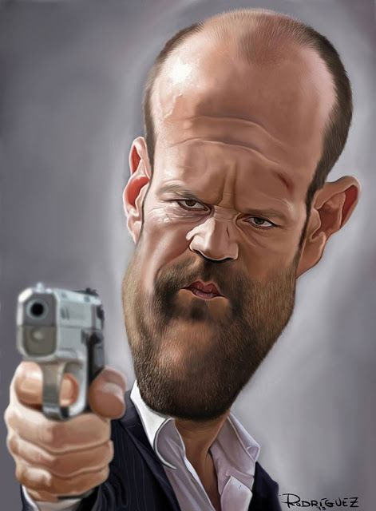
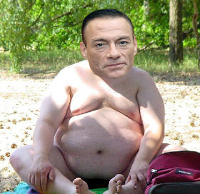
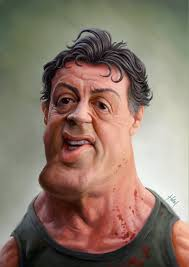
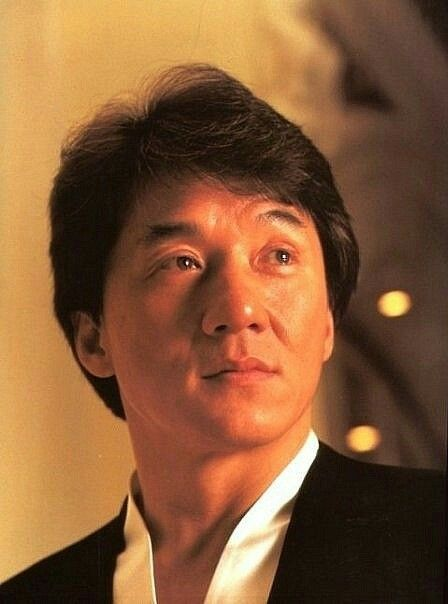

1.Ulan Iskanderov

2.iskanderovulan@gmail.com @iskanderovulan

3.Front-end web development is an exciting career because it's always evolving and constantly changing. This means you'll always have the opportunity to interact with new tools and learn new skills, keeping you engaged in your career. It's a field that provides many opportunities for hands-on learning.

4.Assisted in the monitoring and reporting on website traffic and performance.
Created HTML email templates and newsletters for e-mail marketing campaigns.
Developed web-site mock-ups for clients to ensure quality control and client satisfaction before project development phase.
Executed and monitored standards for user interfaces, page design and graphics development.
Designed complex interfaces to support third party systems.
Web page development from design to test and up to production deployment.

5.<section id="team">
    

        

        
Meet our team

    

        

            

                

                    
 

                    
Jason Statham

                    
Knife designer

                    
Do not seek to change what has come before. Seek to create that which has not.

                

            

            

                

                    

                    
Van Damme

                    
No English

                    
Do not seek to change what has come before. Seek to create that which has not.

                

            

            

                

                    

                    
Sylvester Stallone

                    
Cigar Lover

                    
Do not seek to change what has come before. Seek to create that which has not.

                

            

            

                

                    

                    
Jet Li

                    
I need more money

                    
Do not seek to change what has come before. Seek to create that which has not.

                

            

        

    

</section>
6.Innovative, creative and a proven team player, I possess a Tech Degree in Front End Development and have 6 years building developing and managing websites, applications and programs for various companies. I seek to secure the position of Senior Front End Developer with Orbits International and hope to share my skills, expertise and experience with your team and valuable clients.

7. IT RUN courses, Udemy bootcamp

8.Advanced

